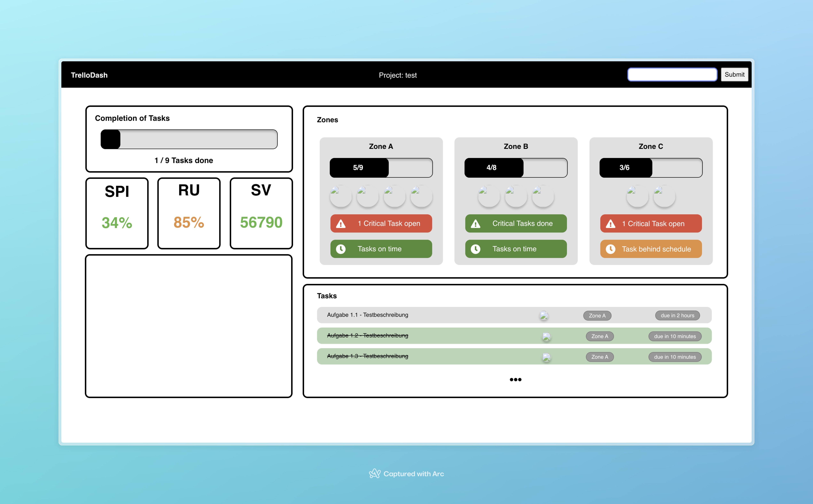
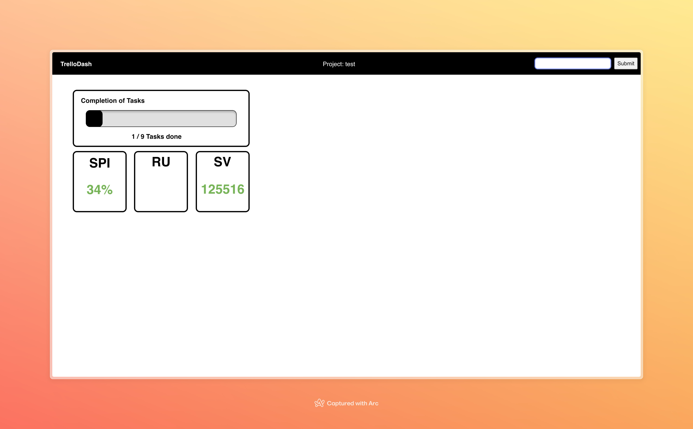
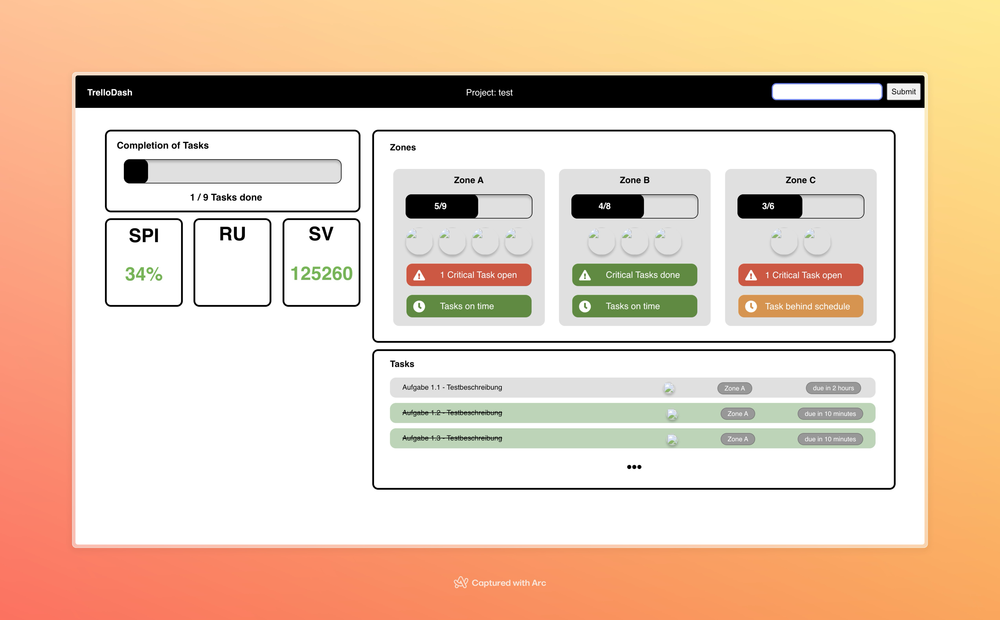

# TrelloDashboard

## Installing the App

```
$ npm install
$ npm run build
```

## Starting the App

```
$ npm run start
```
-> http://localhost:3001

## Building the Frontend

```
$ npm run build
```

### Progress



<details>
    <summary>Earlier stagees</summary> 

#### v0.1.0


</details>